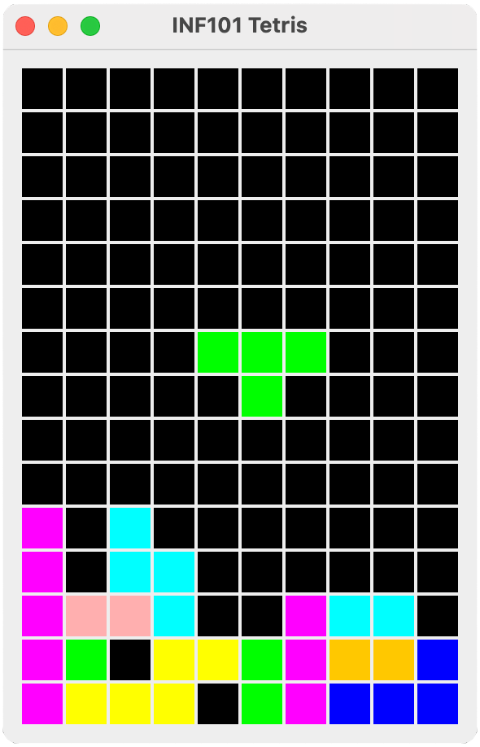

# Tetris

I denne oppgaven skal vi implementere [Tetris](https://en.wikipedia.org/wiki/Tetris). Dersom du ikke har spilt Tetris før, anbefaler vi å prøve. Det finnes mange gratis varianter på internett, for eksempel [htmltetris.com](https://htmltetris.com/).

I denne oppgaven skal du følge en steg-for-steg -guide for å lage et enkelt Tetris-spill fra grunnen av og opp ved hjelp av Swing-rammeverket som er inkludert i Java sitt standard-bibliotek. Selv om det kanskje finnes andre og bedre måter å lage Tetris på, anbefaler vi på det aller sterkeste at du følger denne guiden så nøyaktig som mulig. Det gjør det lettere for oss å hjelpe deg dersom du blir sittende fast.

## Oversikt over arkitektur

Vi vil her først gi et fugleperspektiv av koden vi skal opprette; i guiden som er linket til nedenfor vil opprettelsen av disse klassene gjøres i mer detalj.

Vi baserer modellen vår på design -prinsippet om [model-view-controller](https://en.wikipedia.org/wiki/Model%E2%80%93view%E2%80%93controller), hvor vi i størst mulig grad ønsker å skille fra hverandre
 - selve logikken og datastrukturene i modellen,
 - hvordan modellene *vises*, og
 - hvordan modellen *kontrolleres* av brukeren.

Dette leder oss til at vi deler inn koden vår i tre sentrale pakker: 
 - *inf101v22.tetris.model*
 - *inf101v22.tetris.view*
 - *inf101v22.tetris.controller*

I tillegg vil vi benytte oss av en datastruktur for *Grid* som er mer generell, og som skal være i pakken
 - *inf101.v22.grid*

Det hele kjøres fra `TetrisMain` i pakken *inf101v22.tetris*, som inneholder main-metoden. Foreløpig viser den bare en enkel gui med noen eksempeler på tilfeldige figurer, men når vi er ferdig starter vi Tetris main-metoden her.

### Modell

For å representere et spill med Tetris, er det to hoved-elementer vi må holde styr på:
 - et *brett* med *fliser*, og
 - en *fallende brikke*.

I tråd med prinsippene for objekt-orientert programmering identifiserer vi følgende klasser som egner seg for pakken *inf101v22.tetris.model*:
 - `TetrisModel` en klasse som representerer tilstanden til et komplett spill med Tetris. Denne klassen vil ha feltvariabler som representerer brettet med fliser og den fallende brikken, samt informasjon om spillet er game over.
 - `TetrisBoard` en klasse som representerer et brett med fliser. Dette er i bunn og grunn en variant av Grid som holder på fliser.
 - `Tile` en klasse som representerer en flis på brettet.
 - `Piece` er en klasse som representerer en tetris-brikke
 - `PositionedPiece` er en klasse som representerer en fallende brikke, og består i bunn og grunn av en enkelt brikke og dens posisjon.

 Modellen er på mange måter den viktigste delen av koden, og vi ønsker at koden som ligger i modellen er godt testet.

 ### Visning

 For å vise modellen grafisk, lar vi det det være en klasse `TetrisView` i pakken *inf101v22.tetris.view* som har som ansvar å tegne Tetris-modellen. For å tegne Tetris, er planen at TetrisView
  - først tegner Tetris-brettet, og
  - deretter tegner den fallende brikken "over" brettet.

TetrisView trenger å ha tilgang til modellen for å kunne tegne den, men vi ønsker at vi ikke skal uforvarende kunne *endre* modellen når vi gjør ting i TetrisView. For å innkapsle modellen vår, lar vi `TetrisViewable` være et grensesnitt i pakken *inf101v22.tetris.view* som beskriver hvilke metoder TetrisView behøver for å tegne et Tetris-brett. Så lar vi modellen TetrisModel implementere dette grensesnittet. TetrisView vil altså aldri vite at den (egentlig) jobber med en TetrisModel, den vet bare at den er en TetrisViewable.

### Kontroll

I pakken *inf101v22.tetris.controller* lar vi det være en klasse `TetrisController` som har som sitt ansvarsområde å endre modellen basert på input fra brukeren, samt styre ting som skjer av seg selv (slik som at brikken faller ned et hakk med jevne mellomrom).

På samme måte som for visningen, så er kontrolleren avhengig av tilgang til modellen. Samtidig vil vi innkapsle modellen så mye som mulig. Vi lar det derfor være et grensesnitt `TetrisControllable` i pakken *inf101v22.tetris.controller* som beskriver hvilke metoder kontrolleren trenger tilgang til, og så lar vi modellen vår TetrisModel implementere dette grensesnittet.

## Steg for steg

1. [Opprett en grid -klasse](./guide/01-grid.md)

2. [Tegne brettet](./guide/02-tegnrutenett.md)

3. [Tegne en fallende brikke](./guide/03-tegnbrikke.md)

4. [Flytte en fallende brikke](./guide/04-flyttebrikke.md)

5. [Rotere en fallende brikke](./guide/05-roterebrikke.md)

6. [Droppe den fallende brikken, og håndtere Game Over](./guide/06-droppebrikke.md)

7. [Fjern fulle rekker](./guide/07-fjernefullerekker.md)

8. [En timer flytter brikkene periodisk nedover](./guide/08-timer.md)

9. (Frivillig) [Flere idéer](./guide/09-ideer.md)

10. Fyll ut svar på spørsmålene i [SVAR.md](./SVAR.md)

## Vurdering

I denne oppgaven vil du bli vurdert ut ifra følgende kriterier:

 - Funksjonalitet (6 poeng)
 - Dokumentasjon (2 poeng)
 - Kodestil (2 poeng)
 - Testing (2 poeng)
 - Besvarelser på spørsmål (3 poeng)

 ## Samarbeid

 Dette er en individuell oppgave som benyttes som grunnlag for endelig karakter i faget. Av dette følger det at vi vil rapportere mistanker om juks til instituttet, med tilhørende alvorlige konsekvenser dersom det blir slått fast at juks har funnet sted. Vi klargjør derfor følgende:

 - Vi oppmuntrer til å diskutere med med-studenter underveis.
 - Vi oppmuntrer til å feilsøke sammen med andre studenter, inkludert å se på andre sine studenter sin kode. Men: det må dokumenteres i relevante deler av kildenkoden hvem man har jobbet med når andre studenter får se din kode.
 - Vi oppmuntrer til å diskutere utfordringer med gruppeledere. Hjelp du får av gruppeledere trenger ikke å dokumenteres.
 - Det er lov til å dele korte utdrag av kode med andre, f. eks over discord.
 - Det er *ikke* lov å **skrive av** kode. Når man feilsøker med andre, ser man kanskje andre sine løsninger, og kan bli inspirert av dem. Det er greit: men da må du dokumentere inspirasjonskilden din i relevante deler av kildekoden dersom du bruker noen idéer du har sett. Du kan likevel ikke skrive av løsningen linje for linje, men må reprodusere idéen på egen hånd uten å ha inspirasjonen foran deg.
 - Det er *ikke* lov å dele en komplett eller halvferdig løsning slik at andre har tilgang til den uten din tilstedeværelse. Dette inkluderer å gjøre koden din offentlig tilgjengelig før kurset er over. Vi håper forsåvidt at du ikke gjør den offentlig tilgjengelig senere heller.

 ---

(c) Torstein Strømme 2022, CC-BY 4.0. En objekt-orientert adapsjon av David Kosbie sin Tetris-tutorial for Python [https://www.cs.cmu.edu/~112/notes/notes-tetris/index.html](https://www.cs.cmu.edu/~112/notes/notes-tetris/index.html).
