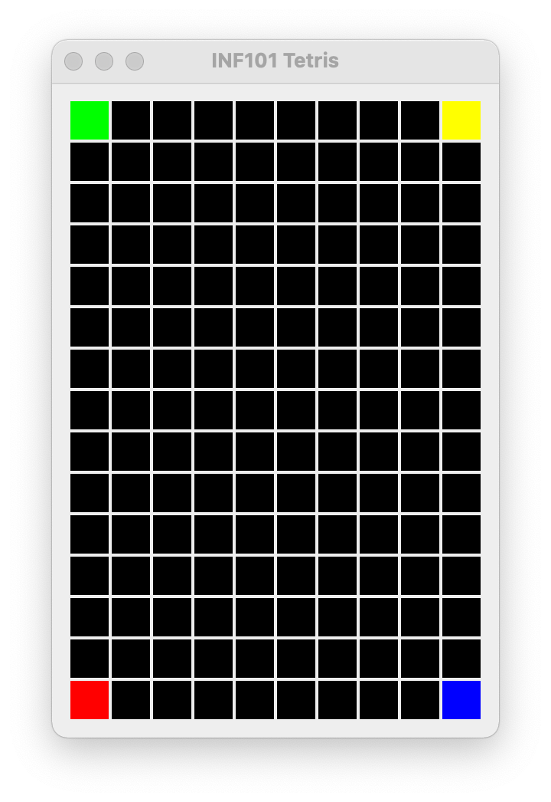
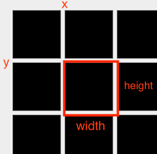

[forrige](./01-grid.md) &bullet; [oversikt](../README.md#steg-for-steg) &bullet; [neste](./03-tegnbrikke.md)

# 2 Tegne brettet

Nå du er ferdig med dette kapittelet, skal du kunne kjøre programmet og bli vist et brett:

### Opprett et view
Opprett en klasse `TetrisView` som utvider JComponent og opprett også et grensesnitt `TetrisViewable` i pakken *inf101v22.tetris.view*
- Ta utgangspunkt i klassen SampleView når du oppretter TetrisView. Inkluder metodene paint (du kan selvfølgelig fjerne selve tegningene) og getPreferredSize.
- La TetrisView ha en konstruktør som tar en TetrisViewable som parameter. Lagre den som en instans-variabel.

For å tegne brettet trenger `TetrisView` å vite
- hvor mange rader det er på brettet
- hvor mange kolonner det er på brettet
- for hver flis, hvilken farge den skal ha

Vi må definere metoder i `TetrisViewable` slik at `TetrisView` kan hente ut denne nødvendige informasjonen. Vi har i bakhodet av vi kun ønsker å ha tilgang til et minimum av nødvendig informasjon; begrens deg f. eks. til disse metodene:
- en metode for å hente antall rader på brettet
- en metode for å hente antall kolonner på brettet
- en metode som returnerer en `Iterable<CoordinateItem<Tile>>` (se mer om *Tile* under) som itererer over alle flisene på brettet. Mer presisit, en metode som returnerer et objekt som, når det itereres over, gir alle koordinatene på brettet med tilhørende fliser.

### Opprett en modell

Alle filene i dette avsnittet hører hjemme i pakken *inf101v22.tetris.model*. Vi skal nå opprette en klasse `TetrisModel` som implementerer TetrisViewable. Men først:
- Opprett klassen `Tile` som representerer en flis. La en Tile holde på to public final verdier:
    - En farge av typen `java.awt.Color`
    - En character, `char` (brukes for testing)
- Opprett en klasse `TetrisBoard` som *utvider* Grid&lt;Tile&gt;. Objekter av denne klassen representerer et brett med fliser.

Vi oppretter nå `TetrisModel`, og lar klassen implementere TetrisViewable.
- La TetrisModel ha en feltvariabel av typen TetrisBoard (et standard Tetris-brett har 15 rader og 10 kolonner).
- La TetrisModel implementere metodene fra TetrisViewable ved å hente det den trenger av informasjon fra nevnte feltvariabel.

> Hint: når du skal implementere metoden som returnerer en `Iterable<CoordinateItem<Tile>>` som kan iterere over flisene på brettet -- har du tilfeldigvis et objekt med denne typen allerede som du enkelt kan returnere? :think:

Det er lurt å skrive tester underveis. For å gjøre det lettere for oss selv, gjør vi noen enkle grep:
- Fyll ut hjørnene på brettet med fliser i ulike farger i konstruktøren til TetrisModel. Denne koden fjerner vi senere.
- Skriv en metode `toCharArray2d` i TetrisBoard som returnerer en `char[rows][cols]` som representerer brettet. Benytt for eksempel `'-'` for null -verdier, og `tile.character` ellers.
- Skriv en funksjon `charArray2dToString` som tar en 2-dimensjonal array med characters (for eksempel en sånn som blir returnert fra toCharArray2d) som input og returnerer en streng hvor symbolene på hver rad er slått sammen, og hver rad avsluttes med `\n` (newline).

### Knyt det sammen

I `TetrisMain`, endre main-metoden det slik at det er et `TetrisView` -objekt som vises i stedet for `SampleView`. Det er her må opprette et TetrisView -objekt. Dermed er det også her du oppretter et `TetrisModel` -objekt her som du så gir som argument til TetrisView-konstruktøren.

Du skal nå kunne kjøre koden uten kompileringsfeil og vil se et tomt vindu (eller firkanter, hvis du ikke fjernet dem fra paint-metoden enda).

### Å tegne brettet

Vi skal nå implementere `TetrisView`. Før du begynner på denne seksjonen, er det viktig at du forstår hvordan eksemplene i SampleView virker. Legg spesielt merke til at y-aksen vokser *nedover*, det vil si at høyere verdi for *y* betyr lengre ned på skjermen. Dette gjelder (nesten) universelt når det kommer til GUI-programmering, så det er like greit å bli vant til det først som sist.

Å tegne flisene hadde vært lettere om vi ikke hadde hatt avstand mellom dem. Men for å tegne flisene på en pen måte, er det viktig at avstanden mellom flisene er nøyaktig lik over hele brettet. For enkelhets skyld, forestiller vi oss derfor at en "flis" består både av selve flisen, men også av tomrommet som er nedenfor og til høyre for flisen. 

Vi oppretter en hjelpemetode `drawTileWithRightBottomPadding` for å tegne én enkelt flis (området som er innefor det røde på bildet). Denne hjelpemetoden tar som parametre:
- Et Graphics-objekt å tegne på,
- en x-verdi og 
- en y-verdi som indikerer koordinatet øverst til venstre hvor flisen skal tegnes,
- en bredde-parameter og
- en høyde-parameter som indikerer hvor stor flisen (inkludert padding) skal være, 
- en padding-verdi som indikerer hvor stor avstand det skal være mellom rutene, samt
- et `java.awt.Color` -objekt som indikerer fargen som flisen skal ha.

Når du implementerer metoden er det viktig at padding-verdien respekteres for at resultatet blir fint.

Det neste steget er å lage en hjelpemetode `drawBoardWithRightBottomPadding` som tegner alle flisene ved siden av hverandre (området som er innenfor den røde firkanten på bildet under). Legg merke til at området vi tegner vil ha litt ekstra luft nedenfor og til høyre.

Over: illustrasjon av drawBoardWithRightBottomPadding ([full størrelse](./pics/drawBoardWithRightBottomPadding.png))

På samme måte som for en enkelt flis, lar vi parametrene til `drawBoardWithRightBottomPadding` være et Graphics-objekt, x og y -koordinater for hjørnet oppe til venstre (på bildet: xBoard, yBoard), samt bredde (boardWidth), høyde (boardHeight) og padding. Metoden itererer over alle flisene på brettet, regner ut hvor flisen skal plasseres (se mine notater på bildet over), og kaller hjelpemetoden som tegner hver enkelt flis.

> Hint: Når det gjelder utregninger for å bestemme hvilke argumenter vi skal gi til hjelpemetoden som tegner en enkelt flis, vil de ligner veldig på dem som gjøres i `drawChess` -metoden som ligger i `SampleView`.

Da gjenstår det å implementere en metode `drawTetrisBoard` som tegner hele tetrisbrettet. Den tar (i likhet med overnevnte metoder) parametre Graphics, x, y, bredde, høyde og padding. Det eneste denne metoden gjør er å kalle drawBoardWithRightBottomPadding, men justert bittelitt slik at det også blir padding langs toppen og venstre side.

Helt til slutt kaller vi på drawTetrisBoard fra `paint` -metoden i `TetrisView`. Der kan du legge til enda et ekstra lag med padding for å få en tykkere ramme rundt hele brettet om du ønsker. Benytt gjerne `this.getWidth()` og `this.getHeight()` for å få vite størrelsen på vinduet. Et kall til `drawTetrisBoard(canvas, m, m, windowWidth - 2 * m, windowHeight - 2 * m)` vil da tegne tetris-brettet sentrert i vinduet med en ekstra margin ytterst rundt brettet på `m`. Brettet vil da også endre størrelse sammen med vinduet om vinduet blir resizet.

### Oppdatere getPreferredSize

For å få et pent spill med Tetris, kan vi regne ut hvor stort vi ønsker at vinduet vårt skal være når vinduet åpnes. Dersom du foretrekker at flisene har størrelse *s* i høyde- og bredde-retning med en avstand/padding på *p*, blir regnestykket noe sånt som
- preferredWidth = (s + p) * numberOfColumns + p + eventuell ekstra padding.
- preferredHeight = (s + p) * numberOfRows + p + eventuell ekstra padding.

Merk at getPreferredSize bare blir brukt når viduet åpnes; dersom brukeren endrer størrelsen på vinduet manuelt senere, betyr ikke denne metoden noen ting lengre. For å regne ut hvor stort brettet skal være basert på vinduets faktiske størrelse, bruk this.getWidth og this.getHeight i stedet.

---

:white_check_mark: Du er klar for neste kapittel når du kan kjøre TetrisMain og et Tetris-brett vises med riktige farger i hjørnene.
