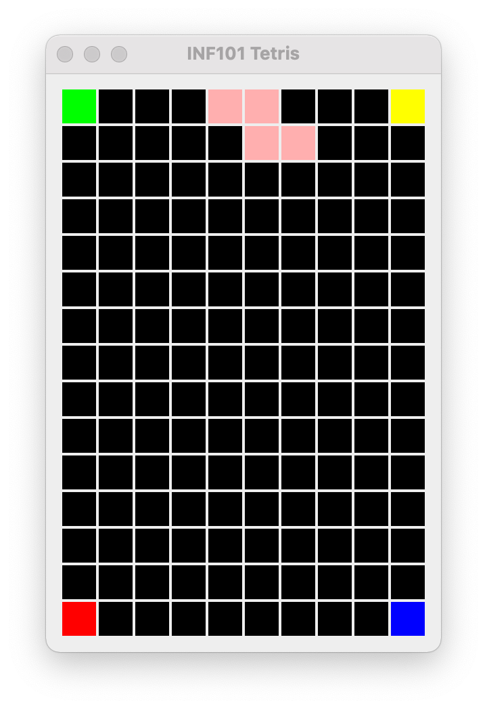
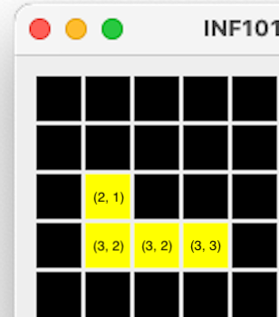

[forrige](./02-tegnrutenett.md) &bullet; [oversikt](../README.md#steg-for-steg) &bullet; [neste](./04-flyttebrikke.md)

# 3 Tegne brikken

Når du er ferdig med dette kapittelet, skal du kunne kjøre programmet og se en brikke øverst på brettet.

[](./pics/drawBoardWithPiece.png)

Før brikken kan tegnes, må vi opprette en struktur i modellen vår for å representere en fallende brikke.

## Modellen
I modellen oppretter vi en pakke *inf101v22.tetris.model.piece*. I denne pakken skal vi opprette tre klasser: `PieceShape`, `PositionedPiece` og `PositionedPieceFactory`.

### PieceShape
Opprett en klasse `PieceShape` som representerer en brikke.
- Internt i klassen `PieceShape` representerer vi en brikke som en to-dimensjonal array av boolean. For eksempel kan T-brikken representeres som
```java
new boolean[][] {
    {  true,  true,  true },
    { false,  true, false }
}
```
- La konstruktøren til `PieceShape` ta som parameter en `Tile` (som representerer utseende til flisene brikken skal tegnes med) og en `boolean[][]` som representerer fasongen til brikken.
- Implementer metodene `getShape`, `getWidth`, `getHeight` og `getTile`.

Husk å ha eventuelle tester i samme pakke som PieceShape -- du må opprette mapper i test-hierakriet som matcher dem i main-hierarkiet.

I et standard Teris -spill finnes det 7 ulike brikker:
```java
// T
new boolean[][] {
    {  true,  true,  true },
    { false,  true, false }
}
// S
new boolean[][] {
    { false,  true,  true },
    {  true,  true, false }
}
// Z
new boolean[][] {
    {  true,  true, false },
    { false,  true,  true }
}
// I
new boolean[][] {
    { true,  true,  true, true }
}
// J
new boolean[][] {
    { true, false, false },
    { true, true,  true }
}
// L
new boolean[][] {
    { false, false,  true },
    {  true,  true,  true }
}
// O
new boolean[][] {
    {  true,  true },
    {  true,  true }
}
```

Opprett konstanter i `PieceShape` for hver av de standard brikkene, for eksempel en konstant `static final PieceShape T` som er et PieceShape-objekt som representerer T-brikken. La det også være tilgjengelig en array av alle standardbrikkene (*static final PieceShape[] STANDARD_TETRIS_PIECES = { T, S, Z, I, J, L, O }*). Ved å eksponere de standard brikkene som konstanter, kan vi gjøre konstruktøren til Piece private men likevel få tak i brikker (dette ligner litt på en enum, men er bare nesten det samme - som vi vil se når vi kommer til rotasjon senere, vil vi fremdeles kunne lage modifiserte kopier, noe som ikke er mulig i enum).

### PostionedPiece

Neste punkt er å opprett en klasse `PositionedPiece` som implementerer grensesnittet `Iterable<CoordinateItem<Tile>>`. Et objekt i denne klassen representerer en brikke med en posisjon.

- La konstruktøren ta som parameter et `PieceShape` -objekt og et koordinat (for hjørnet øverst til venstre).
- Ha metoder `getWidth`, `getHeight`, `getTile` og implementer `iterator` -metoden. Ha i mente at koordinatene som returneres av iteratoren skal være posisjonen til den enkelte flis relativt til brikken, men pluss posisjonen til brikken som helhet.



For eksempel skal en J-brikke med plassering på rad 2 og kolonne 1 gi oss en iterator som itererer gjennom koordinatene (2, 1), (3, 1), (3, 2) og (3, 3).

 Bruk gjerne samme triks som vi gjorde i Grid for å lage en iterator.

- Opprett en test eller to for PositionedPiece. Test for eksempel at iteratoren virker.


### PositionedPieceFactory

Opprett en klasse `PositionedPieceFactory`. Planen vår er at den eneste måten å få tak i et nytt `PositionedPiece` -objekt utenfra pakken er ved å kalle på metoder i PositionedPieceFactory. La derfor konstruktørene til PositionedPiece være package private (altså default/ingenting: verken public eller private), slik at ingen utenfor piece-pakken uforvarende gjør feil.
- Ha en metode `setCenterColumn` i PositionedPieceFactory som definerer rundt hvilken kolonne nye brikker skal være sentrert.
- Ha en public metode `getNextPositionedPiece` som velger en (tilfeldig) `PieceShape` og oppretter en ny `PositionedPiece` basert på den.

For å sentrere brikken rundt sentrums-kolonnen som blir definert av setCenterColumn, kan vi la kolonne-posisjonen til den nye PositionedPiece -brikken være lik dette sentrumet, men minus halvparten av brikkens bredde.

> Tips for å kunne lage tester: La PositionedPieceFactory ha en ekstra konstruktør til test-formål, som har en parameter som er en liste med PieceShape -objekter. Så lenge listen eksisterer og ikke er tom, la *getNextPositionedPiece* plukke ut neste PieceShape fra listen i stedet for velge tilfeldig.

### TetrisModel
Til slutt, i `TetrisModel`:
- La det finnes feltvariabler av typene `PositionedPiece` og `PositionedPieceFactory`.
- I konstruktøren, opprett et nytt PositionedPieceFactory, og kall setCenterColumn med en passende verdi (bredden av brettet/2).
- Initier feltvariabelen av typen `PositionedPiece` i konstruktøren ved hjelp av et kall til `getNextPositionedPiece`.
- Implementer metodene som kreves av TetrisViewable (se under)

For test-formål kan vi også
- La det finnes en konstruktør for TetrisModel som tar inn et `PositionedPieceFactory` som parameter istedet for å opprette det selv.
- Skrive en metode som produserer en `char[][]` -array som limer sammen den fallende brikken med resten av brettet. Benytt resultatet av den tilsvarende metoden i TetrisBoard som utgangspunkt, men overskriv feltene hvor den fallende brikken befinner seg.

Som alltid, husk å skrive tester og dokumentasjon underveis. Bruk selvforklarende og presise variabel- og metode navn, hold metode-kroppene korte og forståelige, og benytt heller en hjelpemetode for mye enn en for lite.

## Visningen

Planen er å la TetrisView tegne den fallende brikken "over" brettet.

- Definer en ny metode i `TetrisViewable` som tilgjengeliggjør koordinatene og flisene til den fallende brikken, på akkurat samme måte som vi gjorde det for brettet.
- Opprett en metode i `TetrisView` for å tegne disse flisene. Husk at denne metoden må kalles *etter* at selve brettet er tegnet. (Går det an å gjenbruke noe vi har gjort tidligere? Du trenger kanskje å endre litt på hvilke argumenter som blir gitt til tegne-metodene.)

---

:white_check_mark:  Når du er ferdig med dette steget, skal du kunne kjøre programmet og en "fallende" brikke vil vises (dog ikke falle).