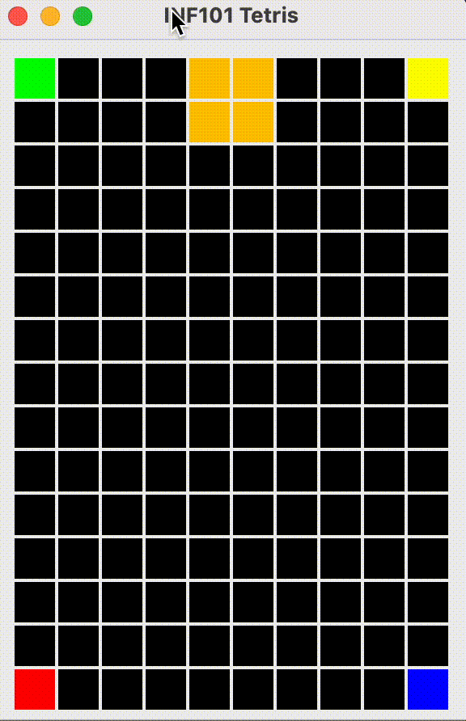

[forrige](./03-tegnbrikke.md) &bullet; [oversikt](../README.md#steg-for-steg) &bullet; [neste](./05-roterebrikke.md)

# 4 Flytte brikken

Når du er ferdig med dette kapittelet, kan du flytte brikken med piltastene nedover brettet.

[](./pics/movePiece.gif)

I dette steget skal vi opprette en kontrollklasse for spillet vårt. I pakken *inf101v22.tetris.controller* oppretter vi
- en klasse `TetrisController`, og
- et grensesnitt `TetrisControllable`.

Vi definerer i TetrisControllable en metode `moveFallingPiece(int deltaRow, int deltaCol)` som skal kunne brukes for å flytte brikken rundt på brettet. Metoden skal returnere en boolean som forteller hvorvidt flyttingen faktisk ble gjennomført eller ike.

## Modellen

Vi lar `TetrisModel` implementere grensesnittet TetrisControllable.

Når vi skal implementere `moveFallingPiece` bruker vi følgende strategi:
- La `PositionedPiece` ha en metode som lager en kopi av seg selv, men flyttet opp/ned/sidelengs i henhold til parametre deltaRow og deltaColumn
- I moveFallingPiece henter vi ut en slik kopi som er en *kandidat* for å bli vår neste fallende brikke.
- Vi oppretter en hjelpemetode som sjekker om en gitt PositionedPiece har en lovlig plass på brettet: det vil si, hvis hele brikken befinner seg innenfor brettets rammer, og ingen av rutene den okkuperer allerede er fargelagt av en flis på brettet, er posisjonen lovlig.
- Dersom vår kandidat er lovlig, så oppdateres modellen.

## Kontrolleren

I konstruktøren til `TetrisController` tar vi som parametre både en TetrisControllable (en modell), og et TetrisView. Vi lagrer dem som feltvariabler.

For å kunne ta imot tastetrykk fra brukeren, trenger TetrisController å gjøre to ting:
- Klassen må implementere grensesnittet `java.awt.event.KeyListener`, og
- objektet av typen TetrisController må bli "installert" slik at det lytter til tastetrykk når et gitt vindu har "fokus."

Siden `TetrisView` er en utvidelse av `JComponent`, representerer et TetrisView -objekt et visuelt element som kan få fokus og motta tastetrykk. For å installere `TetrisController` -objektet som mottaker av tastetrykk som skjer når et TetrisView -objekt "tetrisView" er i fokus, legger vi til følgende linje på slutten av konstruktøren til TetrisController:
```java
tetrisView.addKeyListener(this);
```
> Merk: Det er viktig at det er gjort et kall til `.setFocusable(true)` på TetrisView -objektet. I SampleView gjøres dette på den første linjen i klassen, så hvis du kopierte fra den klassen da du opprettet TetrisView bør dette allerede være i orden.

Vi er nå klare til å håndtere tastetrykk! Fordi TetrisController implementerer KeyListener, må vi ha metodene *keyTyped*, *keyPressed* og *keyReleased*. Vi lar metodene for keyTyped og keyReleased stå tomme, mens vi fokuserer på `keyPressed`:

Parameteren til keyPressed er av typen KeyEvent. Objekter av denne typen har en metode `getKeyCode()` som returnerer hvilken tast som ble trykket. Selv om returverdien er en `int` som ikke sier oss så mye i seg selv, har klassen `KeyEvent` heldigvis haugevis med konstanter som er mer beskrivende. For eksempel, hvis *e* er en variabel av typen KeyEvent, kan vi sjekke hvilken tast som ble trykket slik:
```java
if (e.getKeyCode() == KeyEvent.VK_LEFT) {
    // Left arrow was pressed
}
else if (e.getKeyCode() == KeyEvent.VK_RIGHT) {
    // Right arrow was pressed
}
else if (e.getKeyCode() == KeyEvent.VK_DOWN) {
    // Down arrow was pressed
}
else if (e.getKeyCode() == KeyEvent.VK_UP) {
    // Up arrow was pressed
}
else if (e.getKeyCode() == KeyEvent.VK_SPACE) {
    // Spacebar was pressed
}
```

Fyll inn passende handlinger i keyPressed slik at brikken beveger seg.

### Knyt det sammen

For å faktisk kunne bruke tastetrykk må du opprette et TetrisController -objekt som knyttes til visningen og modellen. Dette er lurt å gjøre i `TetrisMain`, hvor du også opprettet TetrisView og TetrisModel. Derfra kan du enkelt gi dem som argumenter til TetrisController -konstruktøren.

Du kan nå kjøre programmet, og du skal kunnne trykke på piltastene for å flytte brikken -- men du vil ikke kunne **se** endringen med mindre du f. eks. endrer vindustørrelsen mellom hver gang du trykker. Dette er fordi visningen ikke vet at den må tegne på nytt uten at det får beskjed.

For å gi beskjed til visningen at modellen har endret seg, gjør vi et kall til `repaint` (merk: *ikke* direkte til paint) på TetrisView-objektet helt på slutten av keyPressed -metoden.

> Forskjellen på å kalle *paint* og å kalle *repaint* handler om hvilken "tråd" som gjennomfører tegningen. Når det gjøres et kall til keyPressed, skjer dette i en annen tråd parallelt med tråden som har ansvar for visningen. Dersom paint kalles direkte fra keyPressed, kan det derfor skje at to tråder prøver å tegne visningen samtidig, noe som kan gi mye krøll. Det eneste som skjer i *repaint* er at det legges inn en bestilling til visningstråden om å gjøre et kall til *paint*. I praksis går det bare millisekunder før *paint* da blir kalt (men mye kan jo skje på et millisekund i en datamaskin).

---

:white_check_mark:  Du kan gå videre til neste kapittel når du kan flytte brikken med piltastene nedover brettet. Pass på at du ikke kan flytte deg ut av brettet eller plassere deg "over" et av hjørnene vi har fargelagt, og at det heller ikke krasjer når du forsøker.