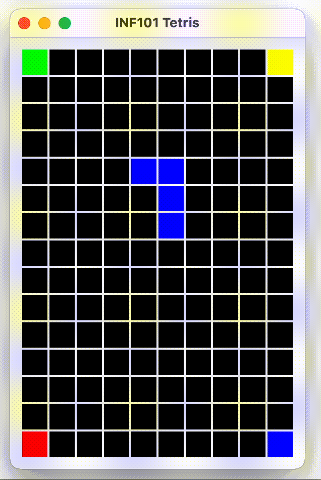
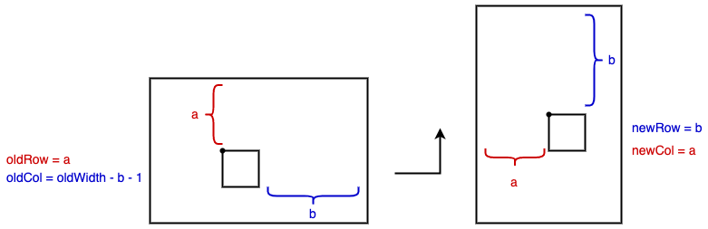

[forrige](./04-flyttebrikke.md) &bullet; [oversikt](../README.md#steg-for-steg) &bullet; [neste](./06-droppebrikke.md)

# 5 Rotere brikken

Når du er ferdig med dette kapittelet, kan du rotere brikken ved å trykke på pil-opp -tasten.

- I `Piece` -klassen, opprett en metode for å lage en rotert kopi av deg selv. Begynn gjerne med å skrive testene for dette: hvis du klarer å rotere L-brikken riktig, er du godt på vei.

- I `PositionedPiece` -klassen gjør vi det samme: vi lager en metode for å returnere en rotert kopi av oss selv. Men merk at rotasjonen skal være rundt "sentrum" av brikken. Det vil si: den midterste kolonne og den midterste raden av den roterte brikken skal være samme punkt som for den orginale brikken. Tips: lag først en rotert kopi med like koordinater, og regn ut sentrum for både original og kopi. Returner så en forflyttet kopi av kopien slik at sentrum blir likt. Sjekk at det virker med I -brikken uten at det ser helt rart ut.
- I `TetrisControllable` definerer vi en metode for å rotere brikken.
- I `TetrisController` kaller vi overnevnte metode når brukeren trykker pil opp.
- I `TetrisModel` implementerer vi metoden på samme måte som vi gjorde for flyttingen: henter en rotert kopi, sjekker om den er lovlig, og hvis ja: oppdater feltvariabelen.

>Pass på at brikken din ikke "drifter," det vil si flytter seg sidelengs på brettet når du trykker pil opp gjentatte ganger.

---

:white_check_mark:  Du er ferdig med dette kapittelet når du kan rotere brikken ved å trykke på pil-opp -tasten. Pass på at du ikke kan rotere brikken "ut av brettet," at brikken ikke kan rotere slik at den legger seg oppå en fargelagt rute, at alle brikkene (også I -brikken) roterer rundt ca sentrum av seg selv, at alle brikkene kommer tilbake til nøyaktig samme posisjon etter fire rotasjoner (to rotasjoner for S, Z, og I), og at O -brikken ikke flytter på seg under rotasjon.