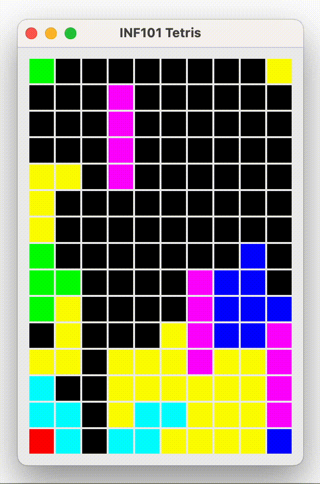

[forrige](./06-droppebrikke.md) &bullet; [oversikt](../README.md#steg-for-steg) &bullet; [neste](./08-timer.md)

# 7 Fjern fulle rekker

Når du er ferdig med dette kapittelet, skal rekker fjernes når vi dropper en brikke slik at en rekke blir full.

[](./pics/clearRows.gif)


Mesteparten av jobben her foregår i klassen `TetrisBoard`. Forslag til nyttige hjelpemetoder:
- En metode som sjekker om et element (f. eks null) eksisterer i en rekke på brettet.
- En metode som fyller en rad med en en gitt verdi.
- En metode som kopierer alle elementene i en rekke inn i en annen. 
> Det kan være fristende å skule til implementasjonsdetaljene i Grid, og trikse til operasjonen med å kopiere en rekke inn i en annen ved å flytte på hele rekker om gangen. Dette kan være effektivt og besparende for prosessoren, men kan også føre til alvorlige bugs hvor den samme rekken opptrer flere steder samtidig. Det tryggeste er å gjøre dette på den "dumme" måten, og rett og slett kopiere element for element i en for-løkke.

Hovedmetoden vår vil være en metode som fjerner alle fulle rekker fra brettet, og returnerer hvor mange rekker som ble fjernet. En måte å løse dette på dersom brettet var fysisk, og vi var to personer, kunne vært noe slikt:
- Person `a` har som jobb å huske/stå ved hvilken rekke vi nå skal fylle.
- Person `b` har som jobb å huske/stå ved hvilken rekke som er den neste vi skal ta vare på.

Begge personene begynner å stå ved nederste rad brettet, og gjentar følgende prosedyre:
- Først sjekker person `b` om rekken han står ved skal tas vare på. Så lenge person `b` står ved en rekke som skal forkastes, går han videre opp til rekken over seg (og teller at han nå har forkastet en rekke).
- Raden person `b` nå står ved kopieres inn i raden person `a` står ved.
- Både person `a` og person `b` går så opp én rad.

Mønsteret over gjentar seg helt til person `b` har forlatt brettet. Så fylles alle radene over `a` med tomme rekker.

Scenarioet over kan vi programmere som en løkke hvor `a` og `b` er variabler, og vi benytter oss av hjelpemetodene nevnt over. I pseudokode blir det noe slikt som:

```java
// La a og b være variabler med verdien 'antall rekker - 1'.
// Så lenge a står på brettet (er større enn eller lik 0):
//     Så lenge rekken b står ved ikke inneholder en blank rute:
//         tell opp at denne rekken ble forkastet
//         la b gå til neste rekke (altså -1)
//     Hvis b fremdeles står på brettet:
//         kopier rekken b står ved inn i rekken a står ved
//     ellers:
//         fyll rekken a står ved med blanke ruter.
//     La både a og b gå til neste rekke
// Returner antall rekker som ble forkastet
```
Pass på at du ikke prøver å gjøre ting med en rekke som ikke er på brettet, da kan du få `IndexOutOfBoundsException` eller noe tilsvarende.

---

I `TetrisModel`, gjør et kall på metoden din i TetrisBoard som fjerner fulle rekker like etter at du har limt den fallende brikken til brettet, men før du har hentet en ny fallende brikke.

Returverdien er antall rekker som ble fjernet. Du kan gjerne bruke den til å regne ut en løpende poengsum. Det er vanlig at poengsummen øker med kvadratet av antall rekker som ble fjernet.

---

:white_check_mark:  Du er ferdig når rekker blir fjernet fra brettet når de blir fulle. Sjekk at det også virker når du får flere fulle rekker på brettet, og at det virker på nederste rad.