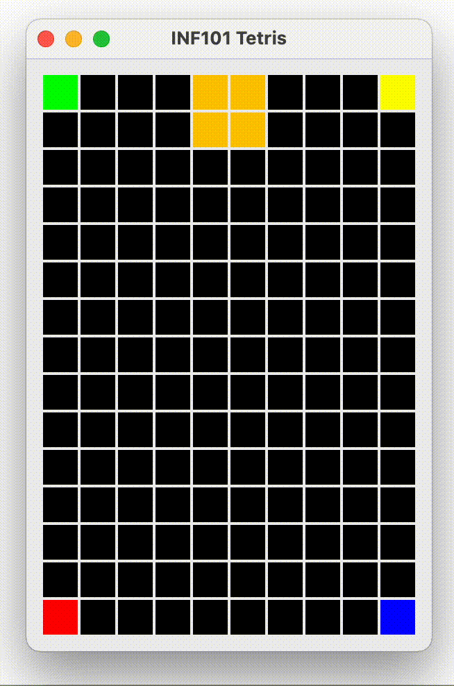

[forrige](./07-fjernefullerekker.md) &bullet; [oversikt](../README.md#steg-for-steg) &bullet; [neste](./09-ideer.md)

# 8 Timer

Når du er ferdig med dette kapittelet, vil brikken falle av seg selv uten at brukeren trykker noe. Da er Tetris ferdig!

## Modellen

Selv om timeren er en del av kontrollen, må vi først forberede modellen med den informasjonen kontrollen trenger.
- Definer i `TetrisControllable` en metode som henter ut hvor mange millisekunder det skal være mellom hvert klokkeslag (f. eks. vil en returverdi på 2000 bety 2 sekunder mellom hver gang brikken faller).
- I `TetrisModel`, implementer overnevnte metode. For å gjøre dette:
    - Opprett en konstant som sier hvor mange millisekunder det skal være mellom hvert klokkeslag når spillet starter.
    - Opprett en feltvariabel som teller antall brikker du har laget i spillet. Oppdater dette tallet i metoden som henter ut en ny brikke.
    - Opprett selve metoden som regner ut passende timer-delay basert på hvor mange brikker som har blitt laget så langt. For eksempel *X * 0.98^Y* hvor X er konstanten for tid mellom klokkeslag i begynnelsen, og Y er antall brikker du har hentet ut så langt.  Hint: bruk Math.pow for å regne ut eksponenter.
- Definer i `TetrisControllable` en metode `clockTick` som er den metoden som kalles hver gang klokken slår. 
- Implemtenter clockTick-metoden i `TetrisModel`:
    - Flytt den fallende brikken en rad nedover. Dersom den ikke fikk lov til å flytte seg, lim den fast i stedet.

## Kontrollen 

Nå til selve timeren. Vi skal bruke en timer som er en del av swing-rammeverket, og tanken er å håndere klokkeslag som kommer fra timeren i klassen `TetrisController`. For å kunne gjøre dette, må TetrisController implementere grensesnittet `java.awt.event.ActionListener`.

- La TetrisController implementere ActionListener og la din IDE opprette den metoden som kreves via quick fix. Den metoden heter `actionPerformed` og tar en `java.awt.event.ActionEvent` som parameter. Det er denne metoden som vil kalles hver gang timeren gjøre et "klokkeslag."
- I konstruktøren til TetrisController, opprett et objekt av typen `javax.swing.Timer`, og lagre den i en feltvariabel. Konstruktøren til Timer tar to argumenter:
    - Det første argumentet er hvor lang tid det skal være mellom klokkeslagene. Hent ut riktig verdi fra modellen og gi det videre.
    - Det andre argumentet er objektet som skal motta klokkeslagene. Der ønsker vi å bruke oss selv, altså gir vi argumentet `this`.
- For å starte timeren, må `start` -metoden til timeren kalles. Dette kan du gjøre på slutten av konstruktøren til TetrisController.
- Opprett en hjelpemetode i TetrisController som henter ut riktig delay fra modellen, og kaller både `setDelay` og `setInitialDelay` på timer-objektet med den nye verdien.
- I metoden `actionPerformed` gjør vi følgende:
    - Hvis game state er ACTIVE_GAME:
        - Gjør et kall til `clockTick` på modellen.
        - Gjør et kall til `repaint` på visningen.
        - Gjør et kall til hjelpemetoden vår som oppdaterer delay for timeren.

For å gjør opplevelsen av nedover-trykking og dropping litt smuudere, legg gjerne inn et kall til `restart` på timeren etter at brukeren har trykket pil-ned og space. For pil-ned-trykket, gjør bare kallet til reset dersom brikken faktisk flyttet seg. Da unngår vi at brikken aldri limer seg fast når brukeren trykker på pil ned kjempefort.

## Ferdigstill

Fjern koden som fargelegger hjørnene.

:white_check_mark: Du er ferdig dersom brikken faller periodisk nedover i økende hastighet etterhvert som du får nye brikker, og du kan spille Tetris uten bugs!

## Legg til musikk
I `TetrisController`, opprett en feltvariabel av typen `TetrisSong` initiert med et nytt objekt. På slutten av konstruktøren, gjør et kall til `run` på objektet.

--- 

:boom: Du er ferdig! Se noen tips til hva du kan gjøre for å finpusse på neste side, og svar på spørsmålene i [SVAR.md](../SVAR.md). Vi kan ikke utelukke et bonuspoeng eller to for ekstra godt og kreativt arbeid.
